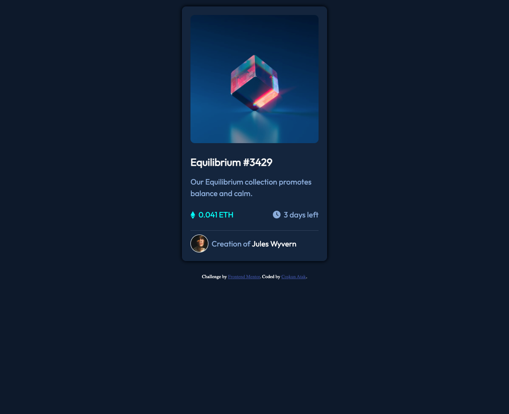

# Frontend Mentor - NFT preview card component solution

This is a solution to the [NFT preview card component challenge on Frontend Mentor](https://www.frontendmentor.io/challenges/nft-preview-card-component-SbdUL_w0U). Frontend Mentor challenges help you improve your coding skills by building realistic projects. 

## Table of contents

- [Overview](#overview)
  - [The challenge](#the-challenge)
  - [Screenshot](#screenshot)
  - [Links](#links)
- [My process](#my-process)
  - [Built with](#built-with)
  - [What I learned](#what-i-learned)
- [Author](#author)
- [Acknowledgments](#acknowledgments)

**Note: Delete this note and update the table of contents based on what sections you keep.**

## Overview

### The challenge

Users should be able to:

- View the optimal layout depending on their device's screen size
- See hover states for interactive elements

### Screenshot



### Links

- [Solution HTML](https://github.com/Coskntkk/Frontend-Mentor-NFT-preview-card-component-solution/blob/main/index.html)
- [Solution CSS](https://github.com/Coskntkk/Frontend-Mentor-NFT-preview-card-component-solution/blob/main/styles.css)
- [Live Site URL](https://your-live-site-url.com)

## My process

### Built with

- Pure HTML & CSS

### What I learned

I have never came across such a scenario where i need to change a items's property in another element's hover.

So in order to code banner hover, i had to write this code:

```html
<div class="topimage">
    
    <div class="hover">
        
    </div>
</div>
```
```css
.topimage {
    position: relative;
}

.hover {
    width: 100%;
    background-color: hsl(178, 100%, 50%);
    opacity: 0.8;
    position: absolute;
    top: 0;
    height: 100%;
    display: none;
    justify-content: center;
    align-items: center;
    border-radius: 10px;
}

.topimage:hover > .hover {
    cursor: pointer;
    display: flex;
}
```

## Author

- Github - [@Coskntkk](https://github.com/Coskntkk)
- Frontend Mentor - [@Coskntkk](https://www.frontendmentor.io/profile/Coskntkk)


## Acknowledgments

Thanks to [Mizgin](https://github.com/MizginYildirak) for telling me about Frontend Mentor and this project.
